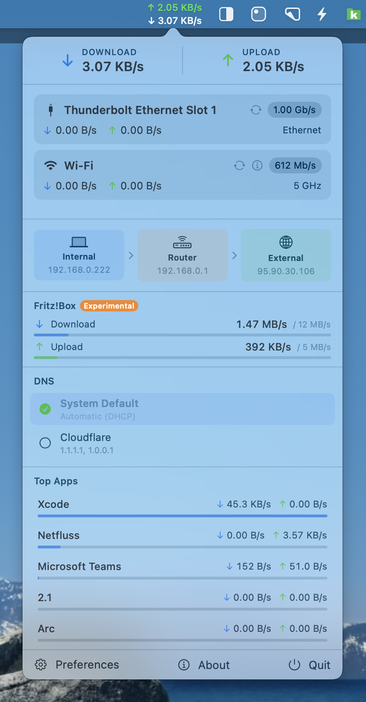

# Netfluss

[](https://github.com/rana-gmbh/netfluss/releases/latest)
[](LICENSE)

A minimal macOS menubar app showing real-time upload and download rates across all active network adapters.

<p align="center">
  
</p>

## Features

### Menubar
- Live upload ↑ and download ↓ rates displayed in the menu bar
- Monospaced digits for stable layout
- Configurable colours for upload and download labels (Preferences → Appearance)
- Configurable font size (8–16 pt) and font style (Monospaced / System / Rounded)
- **Icon mode** — switch to a single network globe SF Symbol instead of rate text (Preferences → Appearance → Menu bar)

### Popover
- **Header** — total Download and Upload rates shown prominently at the top
- **Adapter cards** — each active network interface as a card with:
  - SF Symbol icon for Wi-Fi, Ethernet, or other adapters
  - Link speed badge (Wi-Fi TX rate or Ethernet speed)
  - Per-card DL/UL rates with coloured arrows
  - Wi-Fi frequency band (2.4 GHz / 5 GHz / 6 GHz) or "Ethernet"
  - ↺ reconnect button — cycles the adapter off and back on (Wi-Fi: no password needed; Ethernet: macOS admin dialog)
- **IP addresses** — External, Internal, and Router IP, each with a one-click copy button
- **Top Apps** — optional section listing the top 5 processes by current network traffic, with a relative usage bar per app (enable in Preferences)
- **Footer** — quick access to Preferences, About, and Quit

### Preferences
- Refresh interval (0.5 – 5 seconds)
- Show/hide inactive adapters
- Show/hide other adapters (VPN, virtual interfaces)
- Per-adapter visibility toggles, custom names (pencil button), and drag-to-reorder (≡ handle) — order and names are reflected in the popover
- Display rates in bits or bytes
- **Themes** — System (default), Dracula, Nord, Solarized; changes popover colours and menu bar label accent colours
- Upload / Download label colours (8 swatches, System theme only)
- **Menu bar display** — Rates (live ↑/↓ numbers, default) or Icon (network globe symbol)
- Menu bar font size (8–16 pt stepper) and font style (Monospaced / System / Rounded)
- Top Apps toggle

### About
- Version number with link to release notes on GitHub
- Made by Rana GmbH — www.ranagmbh.de
- Check for Updates — queries GitHub Releases, shows release notes and a Download button when a newer version is found

## Requirements

- macOS 13 Ventura or later
- Xcode 15+ or Swift 5.9+ toolchain (to build from source)

## Install

Download `Netfluss-1.6.zip` from the [latest release](https://github.com/rana-gmbh/netfluss/releases/latest), unzip, and move `Netfluss.app` to `/Applications`.

Netfluss is notarized and signed with a Developer ID — Gatekeeper will clear it automatically on first launch.

## Build from source

```bash
swift build -c release
```

Or open `Package.swift` in Xcode, select the `Netfluss` scheme, and run.

## Notes

- Wi-Fi SSID and band use CoreWLAN. macOS may prompt for Location Services permission to expose SSID details.
- Ethernet link speed is read from `ifi_baudrate` and may show `—` when unavailable.
- External IP is fetched from `api.ipify.org` and cached for 60 seconds.
- Top Apps reads per-connection byte counts from `netstat -n -b -v` and correlates them with process names via `proc_pidpath`. Only processes with active TCP/UDP connections appear in the list.

## License

Netfluss is released under the [GNU General Public License v3.0](LICENSE).
Copyright © 2026 Rana GmbH
