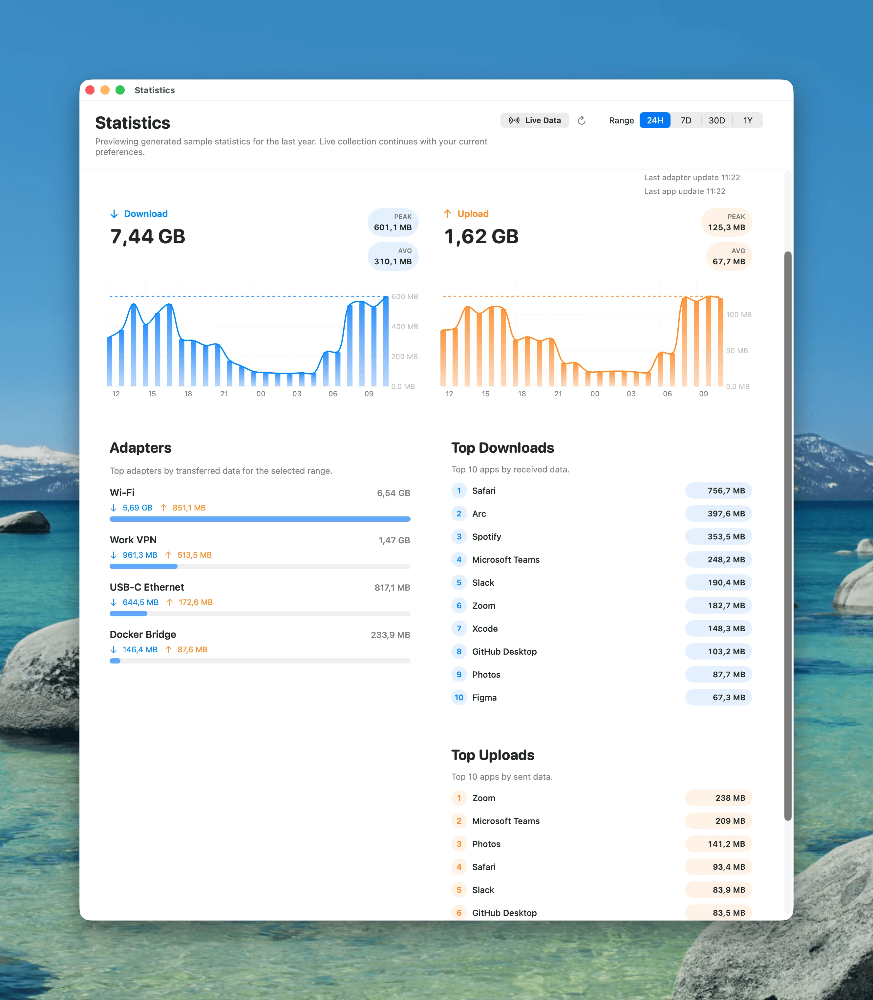
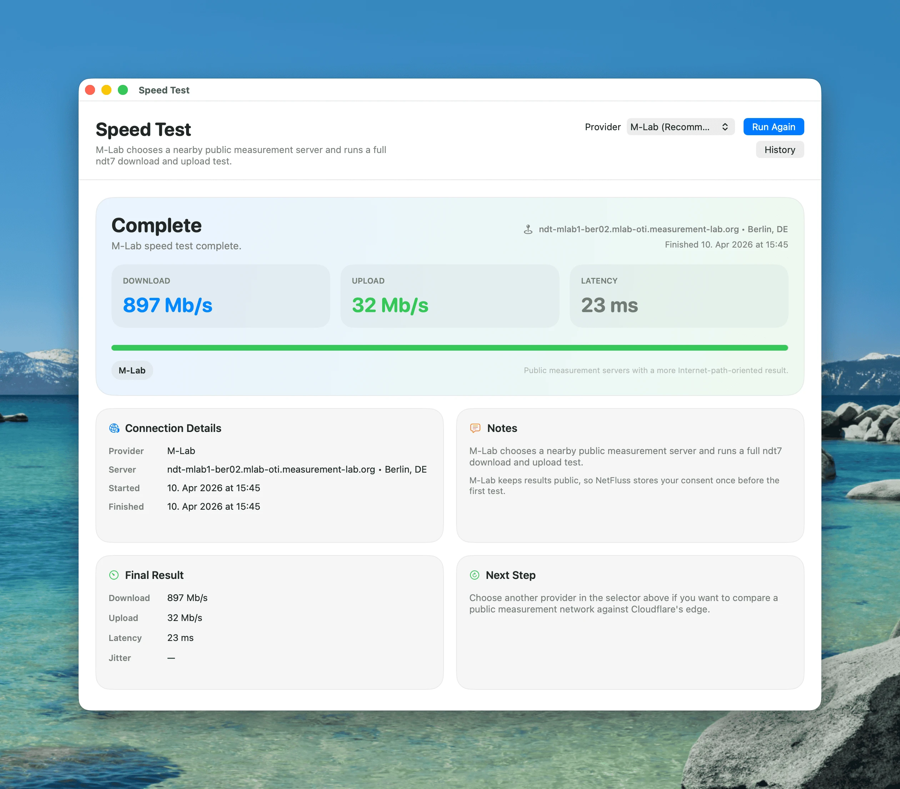

# NetFluss

[](https://github.com/rana-gmbh/NetFluss/releases/latest)
[](https://github.com/rana-gmbh/NetFluss/releases)
[](LICENSE)

NetFluss is a native macOS menu bar app for live bandwidth monitoring, historical traffic analysis, router-aware WAN monitoring, and built-in speed testing.

Latest release: **NetFluss 2.0**

## New In 2.0

### Bandwidth Statistics



- Dedicated statistics window with `1H`, `24H`, `7D`, `30D`, and `1Y` ranges
- Download and upload timelines, top adapters, and top apps
- Optional app statistics collection with energy-conscious background sampling
- Demo/sample data mode for previewing the interface before real history accumulates

### Built-In Speed Test



- Integrated M-Lab and Cloudflare speed tests
- Download, upload, latency, and server details in a dedicated window
- Provider selector remembered between runs
- Right-click the menu bar icon to start a test instantly

### Speed Test History


- Recent test history with date/time, provider, download, upload, and latency
- Useful for quick comparisons across runs and providers

### Refreshed App Icon

- NetFluss 2.0 includes a refreshed app icon and matching menu bar icon option
- Thanks to GitHub user **JohnnyFireOne** for the new icon design

## Features

### Menu Bar

- Live upload and download rates directly in the macOS menu bar
- Four menu bar styles: `Standard`, `Unified pill`, `Dashboard`, and `Icon`
- Separate color choices for upload arrow, download arrow, upload number, and download number
- Configurable font size, font style, unit pinning, and decimal precision
- `Icon` mode with multiple selectable icons, including the new NetFluss app-style icon

### Popover

- Prominent total download and upload summary
- Adapter cards for active interfaces with Wi-Fi / Ethernet / virtual interface details
- Wi-Fi information popover with standard, security, channel, RSSI, noise, SNR, ESSID, BSSID, and TX rate
- External/internal/router IP display in either classic list mode or connection flow mode
- DNS switcher with built-in presets, custom presets, Touch ID support, and drag-to-reorder
- Optional Top Apps view for current per-process traffic
- Router-wide WAN monitoring for Fritz!Box, UniFi, and OpenWRT
- Screen-edge-aware popup positioning so the window stays visible near menu bar borders

### Statistics

- Historical bandwidth analysis by adapter and by app
- Top adapter ranking with automatic `Other` grouping when many interfaces are active
- Top 10 apps for download and upload over each selected range
- Minute-level detail for the `1H` view
- Default-off collection mode to avoid unnecessary energy use

### Speed Test

- Dedicated speed test window launched from the menu bar icon context menu
- M-Lab and Cloudflare providers
- M-Lab consent flow for the first public measurement test
- Persistent speed test history stored locally on the Mac

### Preferences

- Refresh interval from `0.5` to `5` seconds
- Show or hide inactive adapters and virtual/tunnel adapters
- Adapter grace period to keep interfaces visible briefly after they go idle
- Per-adapter visibility, custom names, and drag-to-reorder
- Totals based on visible adapters only, with optional tunnel/VPN exclusion
- Toggle historical statistics collection and app statistics collection separately
- DNS switcher, Top Apps, router bandwidth, menu bar styling, and launch-at-login controls

## Install

Download `NetFluss-2.0.zip` from the [latest release](https://github.com/rana-gmbh/NetFluss/releases/latest), unzip it, and move `NetFluss.app` to `/Applications`.

NetFluss is signed and notarized with a Developer ID certificate, so Gatekeeper should clear it automatically on first launch.

You can also install NetFluss with Homebrew:

```bash
brew install --cask rana-gmbh/netfluss/netfluss
```

## Build From Source

```bash
swift build -c release
```

Or open `Package.swift` in Xcode and run the executable scheme.

## Notes

- Wi-Fi SSID and band use CoreWLAN. macOS may ask for Location Services permission to expose SSID details.
- Ethernet link speed is read from `ifi_baudrate` and may show `—` when unavailable.
- External IP is fetched from `ipwho.is` with `api.ipify.org` as a fallback.
- Top Apps and app statistics use `netstat -n -b -v` plus process resolution via `proc_pidpath`.
- Speed test adapter pinning is not implemented yet; tests currently follow the default active route.

## Support

If you enjoy using NetFluss, consider supporting the project here:

[buymeacoffee.com/robertrudolph](https://buymeacoffee.com/robertrudolph)

## License

NetFluss is released under the [GNU General Public License v3.0](LICENSE).  
Copyright © 2026 Rana GmbH
